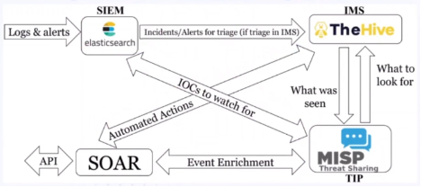

# First Book
<!-- more -->
## Packet Capture & Analysis

* Capture and analysis of data packets
* Control & monitor access for data packets [to detect unauthorized access]
* Know weaknesses [of systems], patches, and updates (monitor [for missing patches])
* Monitor network and endpoints [for suspicious activity]
* Know ports, protocols, domains [used in your environment]

## Full Packet Data Analysis

* DNS - RDP - FTP - SSH - HTTP
* Identify anomalous behavior [compared to baseline traffic]

## Endpoint Monitoring

* Command line monitor [to detect malicious commands]
* Files - Process - Registries - Autorun items - Logs [are key artifacts to monitor on endpoints]

## Log Types by Service Model

* Execution logs → FaaS [Functions as a Service - e.g., AWS Lambda]
* App logs → SaaS [Software as a Service - e.g., Office 365]
* Platform logs → PaaS [Platform as a Service - e.g., Azure App Service]
* Host logs → IaaS [Infrastructure as a Service - e.g., EC2 virtual machines]

## Network & Endpoint [Monitoring Alone Is Not Enough]

* [Traditional monitoring like] AV, IDS, IPS [is not sufficient by itself]
* Monitor data source: routers, switches, proxy [logs]
* Endpoints: DLP, AV, vuln scan [also needed]
* **Integrate all to SIEM** [for centralized visibility]

## Definitions

* **Event** → anything [that happens in the system]
* **Alert** → unwanted event [that triggers a notification]
* **Incident** → [confirmed] threat [that requires response]

## Alert Handling

* Event collection → [apply] rules [to filter what matters]
* Alert triage → investigate [based on] priority

### Two types of alerts:

1. **Signature based** → first priority [known attack pattern, low false positives]
2. **Anomaly based** → [may] not [be] attack [but still needs] investigation

## SOC Tools & Roles

### IMS [Incident Management System] → handle incident → SIRP [Security Incident Response Platform]

### TIP [Threat Intelligence Platform] → collect IOCs [Indicators of Compromise] by threat intel

### SIEM → rules → alerts

### SOAR → automated tasks of SOCs

### Playbook

[[Contains]]

steps for response for attack techniques and tactics → workflow analysis

### Investigation Mindset

Plan your investigation → always ask yourself

[[questions like: what happened? when? which systems?]]

## Classification Frameworks

### VERIS [Vocabulary for Event Recording and Incident Sharing]

* **Actor:** Whose actions affected the asset?
* **Action:** What actions affected the asset?
* **Assets:** Which assets were affected?
* **Attributes:** How was the asset affected? [confidentiality, integrity, availability]

### US-CERT [US Computer Emergency Readiness Team]

[[Scale]]

based 0-100:

* Functional [impact]
* Information [loss]
* Recoverability
* Attack vector
* Incident attribute

## The Hive (Open Source IMS)

### Features:

* Incident management system (open source to learn and use)
* Case organization & tasks
* Observables [IPs, hashes, domains] can be enriched by analyzer → Cortex engine [for automated threat intelligence lookups]
* Can assign cases/tasks to all SOC team

### Roles in The Hive:

**admin**

* Full administrative permissions on the platform; [but] can't manage any Cases or other data related to investigations [by design - separate from SOC analyst work]

**org-admin**

* Manage users and all organisation-level configuration; can create and edit Cases, Tasks, Observables and run Analysers and Responders

**analyst**

* Can create and edit Cases, Tasks, Observables and run Analysers & Responders

**read-only**

* Can only read Cases, Tasks and O

### Key Analogy (keep this):

> "The SOC Analyst is the 'brain' that thinks and analyzes, while The Hive is the 'desk, paper, and files' they use to organize their thoughts and work. Without The Hive, a SOC Analyst would be forced to work with Excel and Notepad, and their work would become extremely chaotic, especially when dealing with a large number of cases."

### In Hive: Create Case

* **TLP** [Traffic Light Protocol] → who can access/view the info
* **PAP** [Permissible Actions Protocol] → what is your permission with data [e.g., can you share it? modify it?]

**White**

- For all [public]

**Green**

- [Within] companies [or community]

**Amber**

- [Limited to] team [with permission to share on need-to-know basis]

**Red**

- None [personal/restricted]

### GitLab

Website

[[or repository]]

for playbooks

[[to store and version control them]]

(to assign the tasks)

## Threat Intelligence

### Definition

* **Intent** - **Capability** - **Opportunity** [three components of adversary analysis]
* Analysis of adversaries [their tools, techniques, procedures]

### Good vs Bad CTI [Cyber Threat Intelligence]

* Poor CTI → no context [just indicators without meaning]
* Excellent CTI → with context [who, why, how, when]
* Store and analysis for known indicators

### De-fanged indicators [to prevent accidental clicking] example:

hxxp://satkas.waw[[[.]]]pl/bainloop/forecast

### TIP Tools:

* MISP [Malware Information Sharing Platform]
* OpenCTI

## MISP Terminology

**Events**

- Encapsulations for contextually linked information [grouping related indicators]. The main entity type you will be creating and adding attributes to

**Attributes**

- Holds indicators (URL, hash, IP), links, text. Child item of events, [each] has a category and type (md5, link, text), and [can have a] comment

**Sightings**

- A way to count true/false positives for an attribute [so you know if an indicator is reliable]

**Tags**

- Additional way to add context to events [e.g., #phishing #ransomware]

**Taxonomies**

- Add families of pre-made tags [standardized classification]

**Galaxies**

- Adds clusters of threat actors, tools, or "intelligence" [e.g., APT28, MITRE ATT&CK techniques]

## SIEM

### Functions:

* Receives all logs [from various sources]
* Aggregation + filtering + indexing [to make logs searchable]

### SIEM Use Case:

* [Can produce] Report [or] Alert

### Use Case Development Fields:

* Name
* Description
* Problem Statement
* Goals
* Requirements
* Primary Data Source [main log source]
* Secondary Data Sources [additional sources for context]
* Analytic Logic [how to detect the condition]
* References
* Suggested Analysis Steps
* False Positive Reduction Steps [how to eliminate noise]
* Categories and framework (MITRE ATT&CK/Kill Chain)
* VERIS
* Compliance/audit support [e.g., PCI, HIPAA]
* Threat group/attribution

### Focus areas when searching logs [during investigation]:

* Image [process executable name]
* Hash [file hash for malware lookup]
* Parent image [what process launched it - key for detecting LOLBins]
* CLI [command line arguments - often contains malicious intent]

## SOAR [Security Orchestration Automation and Response]

### What is SOAR?

[[Platform that combines incident response, automation, and case management]]

### SOAR Value-Adds:

Automation of initial investigation tasks:

**Spam**

- Check logs for extent of email wave

**Web-Exploit**

- Automated domain blocking

**Command and Control**

- Enrichment of domain with data from VirusTotal

**Virus detection**

- Isolate from network

**Phishing**

- Force user password expiration

**Enrichment**

- Look up passive DNS, IP address, Whois, or GeoIP info

**Remediation**

- Craft and send rebuild request to help desk

