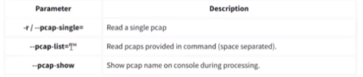
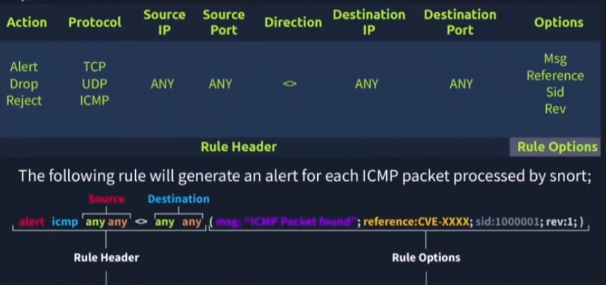
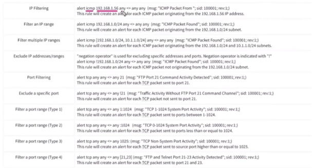
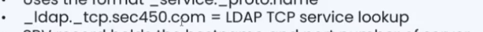

# Second Book

<!-- more -->

## Next-Gen Firewall (NGFW) Capabilities

Examples of what you can do:

* Only IT administrators can use SSH protocol to approved locations
* Gmail is allowed, but no uploads and downloads
* SMB connections are blocked, except to certain machines, on specific share names, sourced from a user in a defined group who authenticated first

## Flow Logs

* Flow log [samples] 1% from real traffic [by default on many platforms]

### Flow Log Opportunities (What flow logs are great for):

* Judging normal/anomaly hunting
* Large uploads and downloads
* Long running connections, high volume of connections
* Looking for lateral movement on your internal network
* Audit remote administration protocols like SMB, RDP, PowerShell, etc. [to] look for signs of malware
* Long running connections
* Odd port numbers
* Match IP addresses/port numbers to threat intelligence

## Packet Capture (PCAP)

* Network TAP or mirrored switch → real traffic
* PCAP analysis in native interface: Arkime [formerly known as Akrime]

### PCAP Analysis Tools:

* Wireshark
* packettool.com

## Wireshark Deep Dive

### Basic Analysis Commands:

* `md5sum file.jpeg` → get image hash
* Analysis → Expert Info → [shows] VIP packets [errors, warnings, notes]
* Statistics option is so important → [helps you] know MAC [addresses, IPs, protocols]

### Statistics Options:

* Resolved addresses → DNS → IP and domain - Ethernet - ports
* Protocol hierarchy
* Statistics → Conversation
* Endpoint → [shows] size and number of packets
* Map → open in browser → [shows] IP location

### Filters:

* Capture filter → saved filters
* Display → Filter expression → gives you [pre-built] filters

#### Example Display Filter:

http.server contains "Apache"

[[filters]]

request or response by

[[Apache web server]]

#### TTL Filter Example:

string(ip.ttl) matches "[[[02468]]]\$"

[[finds]]

server TTL

[[that]]

have even number in IP

## TCP Port Scanning Analysis

### Open TCP Port (3-way handshake):

SYN --><-- SYN, ACKACK -->

### Open TCP Port [with RST from scanner]:

SYN --><-- SYN, ACKACK -->

### Open TCP Port [with RST from scanner]:

SYN --><-- SYN, ACKRST -->

### Closed TCP Port:

SYN --><-- RST, ACK

### SYN Scan (Stealth):

Open TCP Port:SYN --><-- SYN, ACKRST -->

Closed TCP Port:SYN --><-- RST, ACK

### TCP Window:

* TCP window < 1024 [can indicate OS fingerprinting or specific scanning tools]

## UDP Port Scanning Analysis

### Open UDP Port:

* UDP packet --> [no response or expected response]

### Closed UDP Port:

* UDP packet -->
* ICMP Type 3, Code 3 message (Destination unreachable, port unreachable)

## MITM (Man in The Middle) Detection

* MITM Attacker → same IP takes two MAC addresses [indicates ARP spoofing]
* Opcode = 1 [to] request, opcode = 2 reply

## DHCP Analysis

* "DHCP Request" packets contain the hostname information
* "DHCP ACK" packets represent the accepted requests
* "DHCP NAK" packets represent denied requests

### DHCP Filter Options:

Request :  `dhcp.option.dhcp == 3`

ACK :  `dhcp.option.dhcp == 5`

NAK :  `dhcp.option.dhcp == 6`

* Each option tag number has special info

## NetBIOS (NBNS) Analysis

**Definition:** NetBIOS or Network Basic Input/Output System is the technology responsible for allowing applications on different hosts to communicate with each other.

* Global search: `nbns`
* "NBNS" options for grabbing the low-hanging fruits:
* Queries: Query details
* Query details could contain "name, Time to live (TTL) and IP address details"

### Filter Example:

`nbns.name contains "keyword"`

## Kerberos Analysis

### User Account Search:

* CNameString: The username
* **Note:** Some packets could provide hostname information in this field. To avoid this confusion, filter the "value". The values ending with "\$" are hostnames, and the ones without it are usernames.

### Filter Example:

kerberos.CNameString contains "keyword"

[[or]]

(kerberos.CNameString contains "\$")

[[for hostnames]]

### Kerberos Low-Hanging Fruits:

* pvno: Protocol version
* realm: Domain name for the generated ticket
* sname: Service and domain name for the generated ticket
* addresses: Client IP address and NetBIOS name

### Filter Examples:

* `kerberos.pvno == 5`
* `kerberos.realm contains ".org"`
* `kerberos.SNameString == "krbtgt"` [Kerberos ticket granting ticket account]

## Protocol Analogy (DHCP, NetBIOS, Kerberos)

* **DHCP:** Gives you an address to browse the network (Your number on the network).
* **NetBIOS:** Looks up your name or another device's name to reach it (An old directory system).
* **Kerberos:** Makes sure of who you really are and that your password is correct before letting you in (A security and protection system).

### Example Scenario:

> When you arrive at the company and plug your laptop into the switch, DHCP steps in and assigns you an office number (IP Address) so you can connect to the network.If you want to print to a printer named "Printer-1", your device uses NetBIOS to figure out exactly which office number (IP address) "Printer-1" has on the network.Later, when you try to access the company's accounting system, Kerberos steps in your way, asks for your password, verifies your identity, and hands you an "entry ticket" that you can use to open the files.

## ICMP Packet Analysis

* `data.len > 64 and icmp` → [potential data] exf[iltration over ICMP]

## DNS Analysis

* DNS queries → [to] domain [names]

## FTP Analysis

* FTP has response code → [indicates] status of FTP

### Low-Hanging Fruits Detection:

* Bruteforce signal: List failed login attempts
* Bruteforce signal: List target username
* Password spray signal: List targets for a static password

### FTP Filters:

* `ftp.response.code == 530` [login incorrect]
* `(ftp.response.code == 530) and (ftp.response.arg contains "username")`
* `(ftp.request.command == "PASS") and (ftp.request.arg == "password")`
* `ftp.response.code in {430 530}` → incorrect attempt login

## HTTP Analysis

* `http.request.method == "GET"`
* `http.response.code == "200"`
* `request.uri` → [shows] point [or] requested resources from the server

## Log4j (Log4Shell) Analysis - CVE-2021-44228

**Definition:** A Log4j attack (famously known as Log4Shell, technical code: CVE-2021-44228) is a cyberattack that allows a hacker to take complete, remote control of a computer or server without needing a username or password.

### Detection Indicators:

* The attack starts with a "POST" request
* There are known cleartext patterns: "jndi:ldap" and "Exploit.class"

### Detection Filters:

* `http.request.method == "POST"`
* `(ip contains "jndi") or (ip contains "Exploit")`
* `(frame contains "jndi") or (frame contains "Exploit")`
* `(http.user_agent contains "$") or (http.user_agent contains "==")`

## Encrypted HTTPS Traffic Analysis

### Decryption Process (Wireshark):

1. Create folder `.tmp` → put inside `sslkey.log`
2. Edit environment variable → `SSLKEYLOGFILE` = path of file we created
3. Then Wireshark → Preferences → Protocols → TLS → put path → Apply → will decrypt most of them

### Learning Resource:

* `httpbin.com` → learn request and response

## IDS/IPS Types

* **IDS:** NIDS [Network IDS], HIDS [Host IDS]
* **IPS:** NIPS [Network IPS], NBA [Network Behavior Analysis], WIPS [Wireless IPS], HIPS [Host IPS]
* Full blown [device/appliance that does] (IPS + IDS)

## Snort Rule Syntax

### Rule Example:

`alert icmp any any <> any any (msg: "icmp packet found"; sid: 1000001; rev:1;)`

### Locations:

* Rules: `/etc/snort/rules/local.rules`
* Config: `/etc/snort/snort.conf`

### Testing Config:

`snort -T -c /etc/snort/snort.conf`

### Process Management:

ps -ef → task manager

[[shows running processes]]

### Running Snort:

`snort -c /etc/snort/snort.conf -A console` : Start Snort [with console alerts]

`snort -c /etc/snort/snort.conf -A cmg` : Start Snort [with packet details, old param 'cog' means cmg]

`snort -c /etc/snort/snort.conf -A fast` : Log to `/var/log/snort`

`snort -c /etc/snort/snort.conf -A console full`: Full console output

`snort -q --daq afpacket -i eth0:eth1 -A console`: [Using DAQ for inline packet access]

`snort -A full -l [logdir]` : Full alert mode with logging

`snort -A full -l . -r mx-1.pcap` : Read pcap file with full alerts

### Rule Management:

* `local.rules` [where custom rules go]
* Test rule: `snort -c local.rules -A full -r [filename]` [to test rules on pcap]
* `rev` [revision number increments] what change when get edit rule

## DNS Record Types

**PTR : **Reverse DNS [IP → domain]

**TXT : **Text record (msg to DNS): SPF, DKIM (spam prevention)

**CNAME : **Canonical name: sends domain to domain (alias name)

**MX : **Mail server [record]

**SRV : **Service protocol and port

**NS : **Name server of domain

## Threat Intelligence Sources for DNS

* VirusTotal
* Talos Intelligence
* TrustedSource
* ThreatCrowd

## DNS Investigation Factors

* Threat intel [feeds]
* Top-level domain [suspicious TLDs]
* WHOIS [registration] time start [of] domain
* Randomness [of domain name] length
* ASN [Autonomous System Number] - location of downloading [hosting]
* IP → many domains → block domains
* Domain shadowing → add malicious domain to [DNS] table [of legitimate domain]
* Certificate [analysis]
* Connection [patterns]
* DNS tunneling (encode data via DNS)

## DNS Security Considerations

* AV check [can generate] false positive
* Blockchain DNS → non-centralized + encrypted
* IDNs [Internationalized Domain Names]: ASCII English chars [can be spoofed]
* Punnycode: `ü` in German [becomes `xn--`], example: `xn--yutube-wqf.com` [fake youtube]

### Future DNS Protocols:

* DoT [DNS over TLS]
* DoH [DNS over HTTPS]
* DNSSEC [DNS Security Extensions]

### DoH Detection:

* Transaction ID is `0x0000` → [indicates] DoH [not traditional UDP DNS]

## Web Servers

* Apache [web server example]

## HTTP Methods

* GET method → [parameters in] file/text [URL]
* POST → [parameters inside] header [or body]

### HTTP Headers:

* Host
* User-Agent
* Referer
* Path
* Content

## HTTP Protocol Evolution

### SPDY (precursor to HTTP/2):

* HTTP v2 more speed
* Headers separate from data frame
* Encryption
* Server push
* Header binary

### HTTP/3:

* More revision at layer 4 than layer 7
* UDP traffic [instead of TCP]
* Fast
* TLS [built-in]
* QUIC protocol

### Evil HTTP Methods:

* [Methods beyond standard GET/POST that could be malicious like PUT, DELETE, TRACE, CONNECT]

## Malicious Traffic Analysis

* URL analysis [compare with] VirusTotal [to confirm if] is right
* User-Agent analysis
* Python → [often indicates] C2 [command and control]
* User-Agent can be changed by user-agent string [so not always reliable]

### C2 Detection Indicators:

* Cookies → [used by] C2 [like] NotPetya [ransomware], [and] Caches
* Base64 encode → [only] take[s] only 6 bits → [converted to] ASCII
* File analysis → macros, User-Agent, Referer, Host
* C2 detect → many GET/POST requests

### Profiling & Malware Indicators:

* Random domain
* Multiple IPs
* URLs
* Parameters → Exploit kits
* Dynamic DNS (DynDNS) [often abused by attackers]

## TLS Decryption

### What if no TLS decryption? [Analyze different layers]

IP layer : [Source/destination IPs, GeoIP]

TCP layer : Suspicious port `4444` → [often] Metasploit

Session layer : Certificate [analysis]

Application layer : Long traffic [duration or volume]

### Certificate Analysis:

* Host search site → analysis [of] cert[ificate details]

### TLS Fingerprinting:

* JA3, JARM, JA3S → fingerprint → TLS connection [characteristics]

### Threat Intel for TLS:

* sslbl.abuse.ch site → [lists] malware [certificates]

### TLS 1.3 Note:

* No domains [in cleartext] → encryption [of Server Name Indication]

[[هنا صوره ل smtp protocol]]

## SMTP Protocol Analysis

### SMTP Commands:

* `EHLO` [greeting]
* `RCPT` [recipient]

### Email Headers:

* Trace header: server to server [hop-by-hop]
* Message header: To, From
* Email body: content

### Email Security Records:

* MX server
* Domain
* IP
* SPF, DKIM, DMARC?

### SPF (Sender Policy Framework) in a Nutshell:

* Pass
* None
* Soft fail
* Fail

### SPF Trace Header:

* Auth results
* Received SPF header

### DKIM (DomainKeys Identified Mail):

* Digital signature for message

### DMARC (Domain-based Message Authentication Reporting & Conformance):

* [Solves] From problem → header [ensures] == Return-Path + Source IP + SPF + DKIM
* Return-Path is the real path [where bounces go, different from From header]
